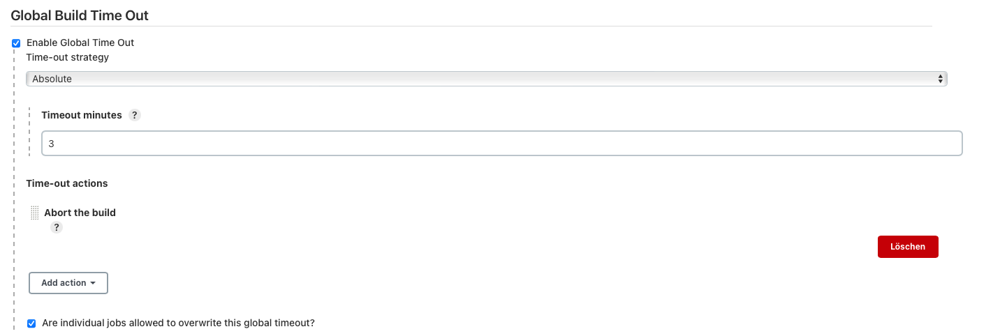
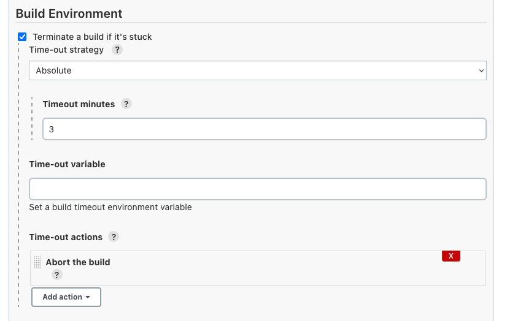
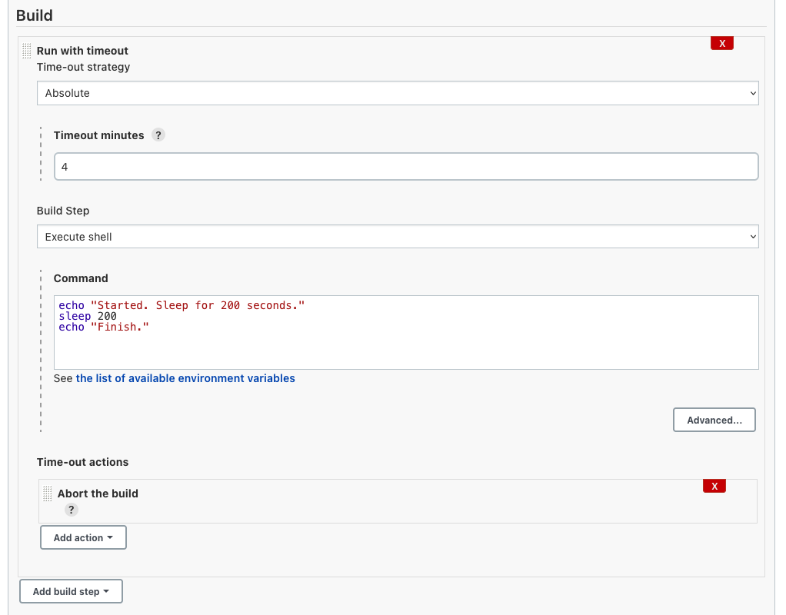

= Build Timeout Plugin

This plugin allows you to automatically terminate a build if it's taking too long.

This plugin isn't applicable to pipelines.

Use the https://jenkins.io/doc/pipeline/steps/workflow-basic-steps/#timeout-enforce-time-limit[`+timeout+` step in workflow-basic-steps] instead.

== Instructions

=== Global Configuration

Go to `Manage Jenkins` and then `Configure System`. Under the item `Global Build Time Out` you can activate a global 
timeout which will be applied to any job. Choose your timeout strategy, the duration and add actions which should be 
executed at timeout.

In addition, the option can be activated that individual jobs can overwrite the global timeout if they 
provide a corresponding build step.

=== Build environment

Alternatively, the timeout can be specified in the build environment of a job. 
To do this, click `Configure` in the job view and in the build environment section, select the item 
`Terminate a build if it's stuck`.

Because Java only allows threads to be interrupted at a set of fixed locations, depending on how a build hangs, the abort operation might not take effect. For example,

* if Jenkins is waiting for child processes to complete, it can abort right away.
* if Jenkins is stuck in an infinite loop, it can never be aborted.
* if Jenkins is doing a network or file I/O within the Java VM (such as lengthy file copy or SVN update), it cannot be aborted.

So if you think the build timeout isn't taking effect, our default assumption is that the build is hanging at the place that cannot be interrupted. If you suspect otherwise, please https://wiki.jenkins-ci.org/display/JENKINS/Build+is+hanging[obtain the thread dump] and report it.

=== Build step

Add a new step `Run with timeout` at the section `Build`, add the timeout strategy and duration, add some actions and 
the build step you want to execute within the timout step.

== Time-out actions with notes

[cols=",",options="header",]
|===
|Time-out action |Note
|Abort and restart the build |Installing https://plugins.jenkins.io/naginator[Naginator Plugin] enables this action
|===

include::CHANGELOG.adoc[]
